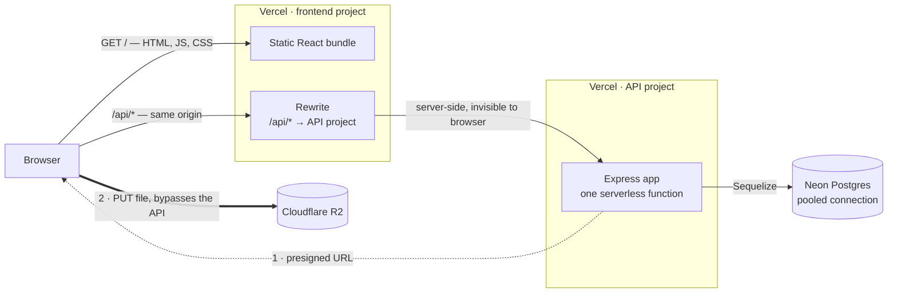
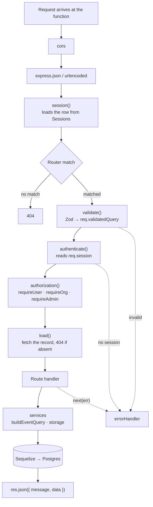
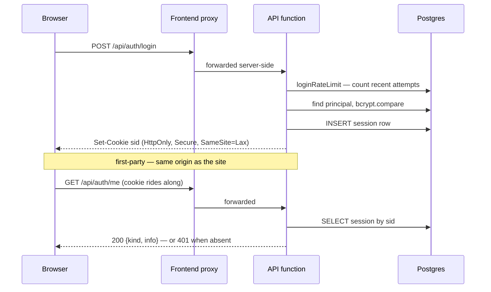

# Benevola — Summary

**Benevola** connects volunteers with the organizations that need them.
Organizations post a shift with a real date, place and capacity; volunteers find
it by cause, distance or date, sign on, and both sides watch the roster fill.

Built at NC State as a university project.

> **This is a demonstration, not a running service.** Every organization and
> event in the database is sample data.

This is the short version. The full document is [`../README.md`](../README.md).

---

## Stack

| Layer | Technology |
|---|---|
| Frontend | React 19, React Router 7, Leaflet |
| Backend | Node.js, Express 5 |
| Database | Neon Postgres in production, SQLite locally — Sequelize ORM |
| Auth | Session cookies in a database-backed store, bcryptjs |
| Images | Cloudflare R2, presigned direct-to-browser uploads |
| Validation | Zod |
| Hosting | Vercel — two projects, both serverless |

Deliberately **not** used: AWS, Lambda, Elasticsearch, JWTs, Redis, Material UI.
Earlier revisions used several of these; all were removed.

---

## 1. How the pieces fit together

Two Vercel projects and two external services. The critical detail is the
rewrite: the browser only ever talks to one origin, so the session cookie stays
first-party and CORS never enters the picture.



Two consequences worth knowing:

- Point the frontend straight at the API domain instead of proxying and every
  request looks logged out — two `*.vercel.app` hosts are *cross-site*, and a
  `SameSite=Lax` cookie is not sent on a cross-site `fetch`.
- Image bytes never occupy a function invocation. The API only signs a URL.

---

## 2. What happens to a request

Every `/api/*` call passes the same chain. Order matters: the session loads
before any route sees the request, and validation runs before authorization so
a malformed request never reaches a permission check.



`buildEventQuery` is where search lives — keyword, tags, date range, time-of-day
and geographic radius compose into one SQL query rather than replacing each
other. It also picks `ILIKE` or `LIKE` by dialect, because SQLite's `LIKE` is
case-insensitive and Postgres's is not.

---

## 3. Sessions and authentication

Auth is a **session cookie**, not a bearer token. A serverless instance cannot
hold state in memory, so sessions are rows in Postgres — and so is the login
rate limiter, which counts attempts in a table rather than a map.



Users and organizations are **separate principals in separate tables**. The
session records which kind is signed in, and middleware enforces which kind each
route accepts.

---

## Layout

```
api/     Express API — its own Vercel project
         18 migrations · 5 seeders · 5 route groups · 7 middleware
fe/      React app — its own Vercel project
         vercel.json holds the /api/* rewrite
         src/variants/default is the design that ships
```

## Things that bite

- **Migrations never run on deploy.** Vercel builds the function; it does not
  touch the database. Run `npm run db:migrate:prod` by hand.
- **Dev is SQLite, production is Postgres, and they disagree** — on `LIKE`
  casing, on `VARCHAR` length enforcement, on date builtins. Working locally is
  not proof.
- **A trailing slash breaks the proxy.** `/api/events/` does not match the
  rewrite, falls through to the SPA fallback, and returns `index.html` with a
  **200** — so the failure surfaces as a JSON parse error, not a status code.

## Where to look next

| For | Read |
|---|---|
| Everything | [`../README.md`](../README.md) |
| Route reference | [`../api/README.md`](../api/README.md) |
| Deploying | [`../DEPLOY.md`](../DEPLOY.md) |
| Seeded logins | [`../SEEDED_ACCOUNTS.md`](../SEEDED_ACCOUNTS.md) |
